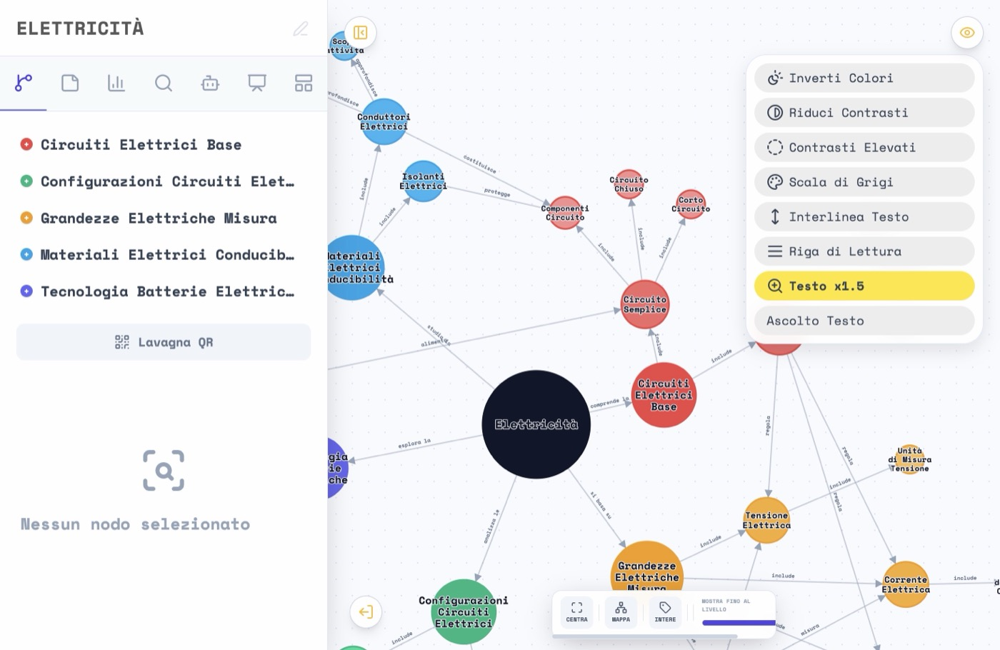
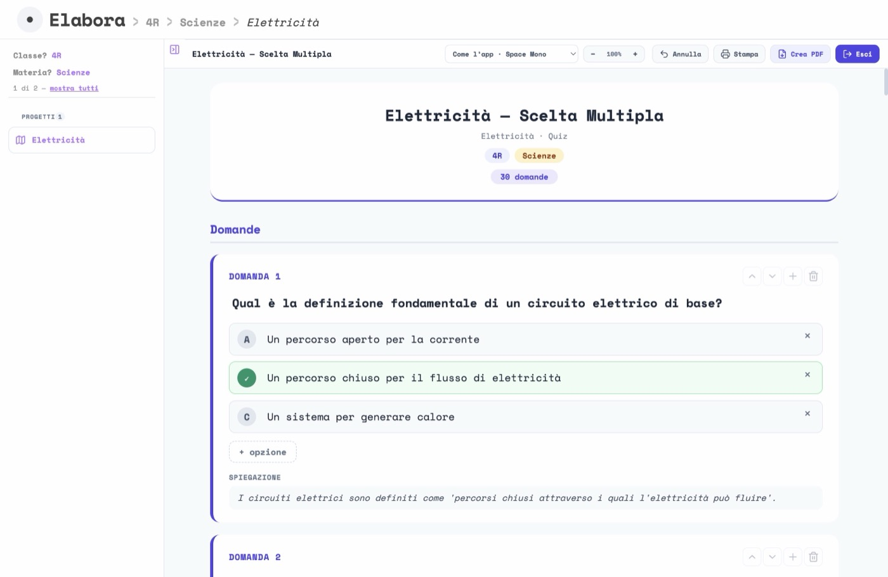
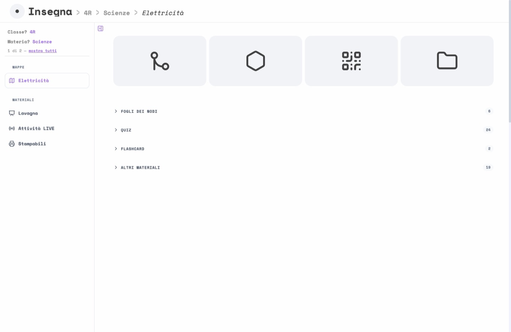
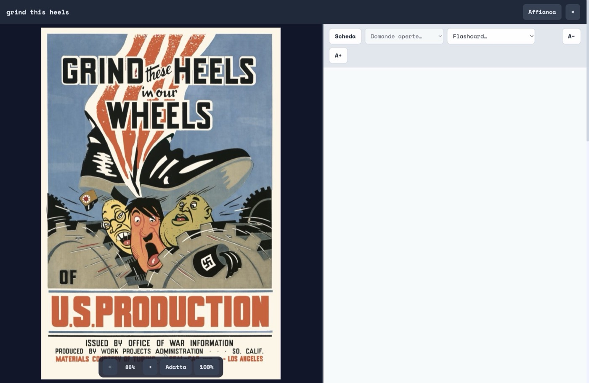
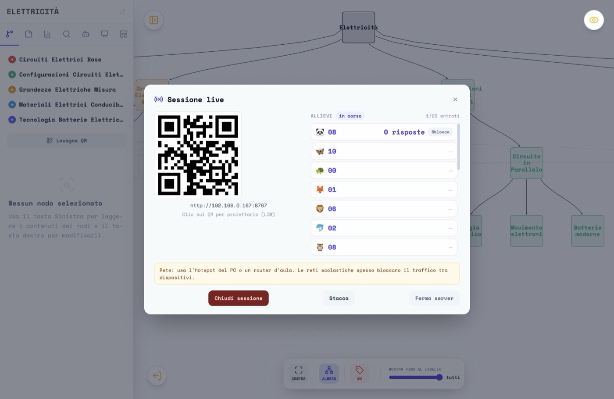
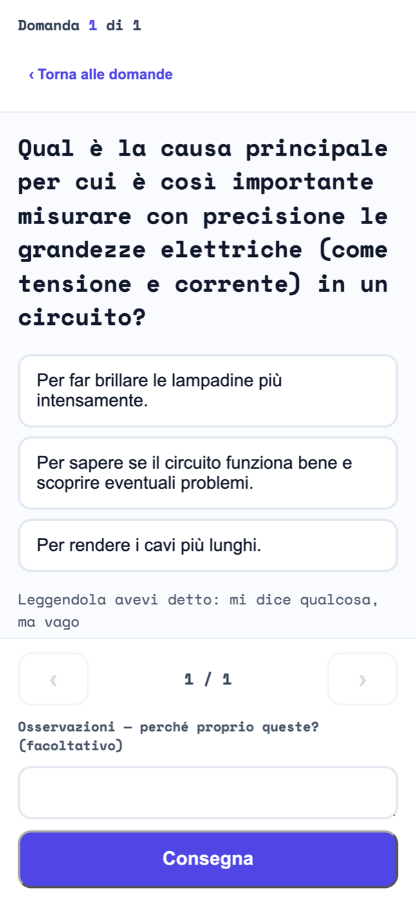

# MappAI

> **Questa presentazione è una bozza.** Le immagini e i testi verranno corretti e
> completati prossimamente: alcune schermate vengono dalla guida per i docenti e
> potrebbero non riflettere l'ultima versione dell'app.

Applicazione desktop per docenti: da una scheda didattica genera una **mappa mentale**
fedele alla fonte e i **materiali di studio** che ne derivano — quiz a scelta multipla,
domande aperte, flashcard, foglio dei nodi, sintesi con voce naturale — tarati sul livello
di lettura della classe, con attenzione a BES e DSA.

Tutto vive in cartelle sul computer del docente. All'AI arriva solo il testo della scheda,
mai i nomi degli allievi.

- Sito: <https://insegnai.ch/mappai/>
- Guida per i docenti, con le fotografie delle schermate: <https://insegnai.ch/mappai/guida/>
- Installer per macOS e Windows: [Releases](https://github.com/gmesc/MappAI/releases)

## La mappa

Il documento di partenza diventa un grafo navigabile: le macro-aree sull'indice a sinistra,
i concetti collegati da verbi che dicono il tipo di legame («include», «regola», «protegge»),
e gli strumenti compensativi sempre a portata — testo ingrandito, interlinea, riga di
lettura, scala di grigi, ascolto del testo.



## I materiali

Dalla stessa mappa nascono i materiali di studio. L'editor mostra l'anteprima di stampa
mentre la si compone, e ogni documento resta modificabile a mano dopo la generazione.



## La classe

La sezione INSEGNA raccoglie le mappe per classe e disciplina, con i materiali che ne sono
derivati e le consegne che tornano indietro dagli allievi.



## Alla lavagna

La proiezione mostra un materiale a tutta parete, pensata per essere letta dal fondo
dell'aula.



## Con i telefoni degli allievi

Un QR sulla lavagna e la classe entra: gli allievi rispondono dal proprio telefono sulla
rete locale, senza account e senza che nulla esca dalla scuola. Il docente segue le
consegne mentre arrivano.

| Il docente segue | L'allievo risponde |
|---|---|
|  |  |

## Come si prova

Il download è gratuito e non serve alcun codice di sblocco: MappAI è software libero, e
il blocco per dispositivo che le versioni beta chiedevano fino alla 1.0.0-beta.4 è stato
tolto. Serve una chiave gratuita di Google Gemini (la guida spiega come ottenerla), oppure
una chiave Infomaniak se preferisci che i dati restino in Svizzera.

## Sviluppo

```bash
npm install
npm start          # avvia l'app
npm test           # suite Node (node --test)
npm run dist       # costruisce gli installer con electron-builder
```

Stack: Electron, JavaScript senza bundler (script globali, niente ES modules), D3.js per il
grafo, Tailwind CSS.

## Licenza

Copyright (C) 2026 Giacomo Meschini.

MappAI è **software libero**: puoi ridistribuirlo e modificarlo secondo i termini della
**GNU General Public License**, versione 3 o successiva, come pubblicata dalla Free Software
Foundation. Il testo completo è in [`LICENSE`](LICENSE).

Il programma è distribuito nella speranza che sia utile, ma **senza alcuna garanzia**;
senza neppure la garanzia implicita di commerciabilità o idoneità a uno scopo particolare.

Chi ridistribuisce una versione modificata deve pubblicarne il sorgente sotto la stessa
licenza. Vedi <https://www.gnu.org/licenses/gpl-3.0.html>.

### Componenti di terze parti

I font e alcune librerie incluse restano sotto le loro licenze (SIL Open Font License,
LGPL-3.0, MIT, Apache-2.0 e altre): l'elenco è in
[`THIRD-PARTY-NOTICES.md`](THIRD-PARTY-NOTICES.md). La GPL non li copre.

### Nome e marchio

«MappAI» e «insegnai.ch», con i rispettivi logo, sono segni distintivi dell'autore. La
licenza riguarda il software, non il nome: una versione modificata e ridistribuita non
dovrebbe presentarsi come «MappAI» senza accordo, per non ingenerare confusione fra chi la
riceve e chi assiste i docenti che usano l'originale.
